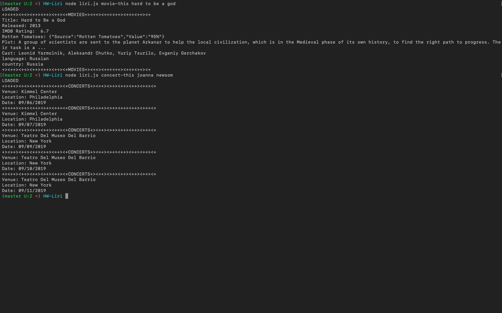
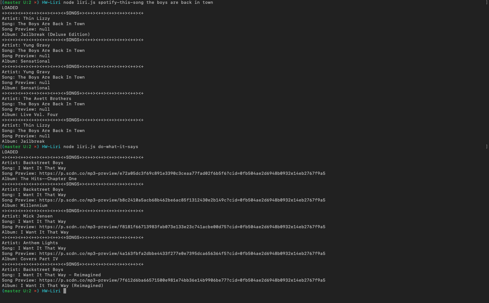

# LIRI APP

LIRI  is a Language Interpretation and Recognition Interface, a command line node app that searches the Online Movie Database, Bands In Town, and Spotify APIs.
 LIRI recognizes these commands

- Spotify-this-song
- Concert-this
- Movie-this
- do-what-it-says

and will search the corresponding APIs for the user input following the command. Except the command do-what-it-says, which reads from the random.txt file.  

## APIs 
-OMDB
-Bands In Town
-spotify

## Technologies
-Javascript
-Node.Js
-Moment
-Node-Spotify-API

